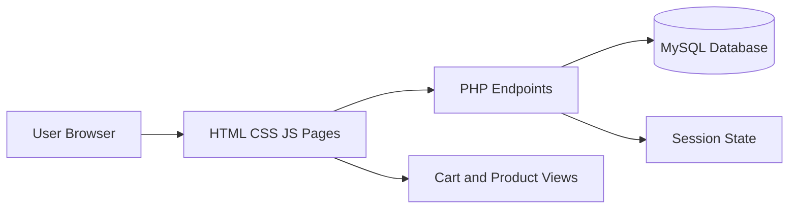

<div align="center">


### A stylish electronics storefront built with HTML, CSS, JavaScript, PHP, and MySQL

[](#)
[](https://www.php.net/)
[](https://www.mysql.com/)
[](#)

</div>

## Spotlight

QuantumElectro is not a plain storefront clone. It is designed to feel energetic and premium with colorful gradients, animated interactions, and practical shopping/account workflows.

- Strong visual identity with vivid gradient components
- Modern page transitions and hover depth
- Authentication and user session flow using PHP
- Database-backed forms and account actions
- Multi-page catalog structure for products and details

## Preview

<div align="center">
	
</div>

## What You Get

| Module | Pages and Capabilities |
|---|---|
| Store Experience | Home, products grid, product detail pages |
| User Journey | Register, login, logout, profile, auth checks |
| Commerce Flow | Cart, order success, order history |
| Contact Layer | Contact form UI + save endpoint |
| Platform | PHP backend scripts + MySQL integration |

## Visual Language

- Color direction: indigo, purple, pink with bold contrast accents
- Depth effects: layered shadows and lift-on-hover cards
- Motion: subtle transitions for cards, buttons, and key sections
- Responsive behavior: layouts adapt for desktop and mobile widths

## Stack

- Frontend: HTML5, CSS3, JavaScript
- Backend: PHP
- Database: MySQL
- Local environment: XAMPP (Apache + MySQL)

## Architecture Snapshot



## Core Files

```text
QuantumElectro/
|- index.html
|- products.html
|- cart.html
|- contact.html
|- login.php
|- register.php
|- profile.php
|- my-orders.php
|- order-success.php
|- db.php
|- script.js
|- style.css
`- images/
```

## Quick Start

1. Move the project into your XAMPP htdocs folder.
2. Start Apache and MySQL from the XAMPP Control Panel.
3. Create the project database and required tables.
4. Verify DB credentials in db.php.
5. Open this URL:

```text
http://localhost/QuantumElectro/
```

Optional local server mode:

```bash
php -S 127.0.0.1:8000
```

## Security and Reliability

- Password hashing for credentials
- Validation and sanitization pathways
- Session-based authentication flow
- Structured PHP to DB interaction layer

## Roadmap

- Payment gateway integration
- Search and advanced filtering
- Product ratings and reviews
- Admin dashboard for inventory/content management
- API-first backend expansion

## Creator

Built by Tejasrn252.

If this project inspires you, give it a star and share your feedback.
