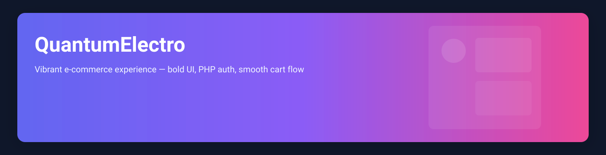

<div align="center">



<!-- toc -->

- [Spotlight](#spotlight)
- [Screenshots & Demo](#screenshots--demo)
- [Highlights](#highlights)
- [Quick Start (local)](#quick-start-local)
- [File map](#file-map)
- [Roadmap](#roadmap)
- [Credits](#credits)

<!-- tocstop -->

### A stylish electronics storefront built with HTML, CSS, JavaScript, PHP, and MySQL

[](#)
[](https://www.php.net/)
[](https://www.mysql.com/)
[](#)

</div>

## Spotlight

QuantumElectro is not a plain storefront clone. It is designed to feel energetic and premium with colorful gradients, animated interactions, and practical shopping/account workflows.

- Strong visual identity with vivid gradient components
- Modern page transitions and hover depth
- Authentication and user session flow using PHP
- Database-backed forms and account actions
- Multi-page catalog structure for products and details

## Screenshots & Demo

<div align="center">
	
</div>

Below is an animated SVG demo showing the product gallery and cart interaction:

<div align="center">
	<object data="public/images/demo.svg" type="image/svg+xml" width="820" height="300">Your browser does not support SVG.</object>
</div>

## What You Get

A polished multi-page electronics storefront with a gradient-driven UI, PHP authentication, and a working cart flow. The repository is organized into `frontend/`, `backend/`, and `public/` to make deployment and maintenance straightforward.

---

## Why this feels premium

- Vivid gradient system that reads well on light and dark screens
- Playful micro-interactions on hero, cards, and CTAs
- PHP-powered auth with session handling and password hashing
- Clean separation: `frontend/`, `backend/`, `public/` for easy deploy

---

## Highlights

- Multi-page product experience (no SPA required)
- Cart flow and order success path
- Register / login / profile / my-orders pages
- Contact form connected to `backend/save_contact.php`

---

## Quick Start (local)

1. Copy the project into your XAMPP `htdocs`.
2. Start Apache + MySQL from the XAMPP control panel.
3. Create the `quantumelectro` database and import any provided schema.
4. Update DB credentials in `backend/db.php`.
5. Visit:

```text
http://localhost/QuantumElectro/
```

Optional: run the PHP built-in server from the project root:

```bash
php -S 127.0.0.1:8000
```

---

## File map

```text
frontend/   # public-facing HTML/CSS/JS
backend/    # PHP endpoints and auth
public/     # images and static assets
index.php   # entry that routes to frontend
```

---

## Roadmap

- Payment gateway (Stripe/PayPal)
- Admin panel + product management
- Search, filters, and sorting UX
- Lightweight API wrapper

---

## Credits

Built and designed by Tejasrn252 — reach out with feedback or collaboration ideas.

If this project inspires you, give it a star and share your feedback.
